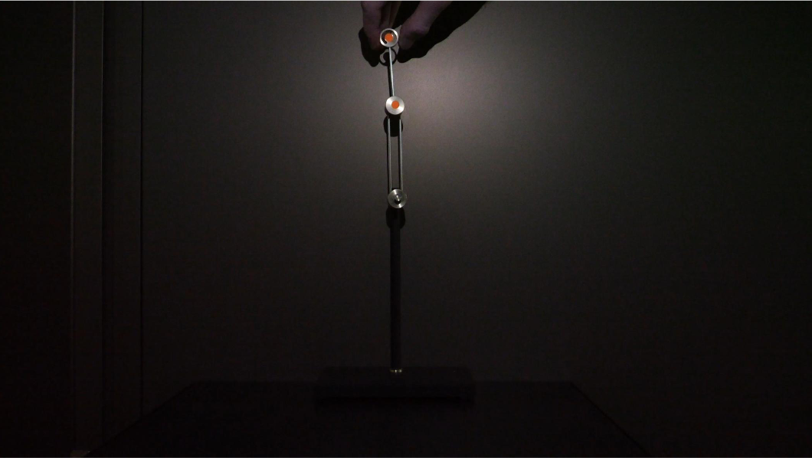

# Double pendulum simulation

This is a simulation of a double pendulum using Julia.

The objectif is too recreate a double pendulum simulation based on videos and to predict his mouvement during 2 seconds past the video end.

**Video:** [First_Video_2s.mp4](assets/First_Video_2s.mp4)


## Theory
A double pendulum is also know as Chaotic pendulum because of its sensibility to initial conditions.

The particularity of this system is his behavior. It can vary from simple periodic motion to a more complex and chaotic one with a small change of initial angles or velocities.


## length of the pendulums (via gimps)
pendulum one = 91.74 mm
pendulum two = 69.33 mm


## Parameters
- length of the first pendulum: L1 = 91.74 mm
- length of the second pendulum: L2 =  69.33 mm
- angles at t=0: θ1 = 181.5° = 3.159, θ2 = 183.1° = 3.194 (θ = 0° is the vertical down position)

## Energy loss
In a real system, energy is lost due to friction and air resistance. This can be modeled by adding a damping term to the equations of motion.
We will have something like this:
$\begin{pmatrix}m_1\\m_2\\\alpha_1\\\alpha_2\end{pmatrix}$
where α1 and α2 are the angular accelerations of the first and second pendulums, respectively.
They will represent the energy loss in the system.

This energy loss is negligible for the first 1 second of the video, wich will help to find the mass of the two pendulums.
From the second 1, the energy loss will be taken into account to predict the motion of the pendulum after the video end.

The approch will be to find the mass of the two pendulums that minimize the difference between the simulated and observed positions over the first second.
And to find the angular accelerations, one of the approch will be to calculate the difference of energy between two frames and to divide it by the moment of inertia of each pendulum.
Or to test different values of angular accelerations to see which one fit the best with the observed data.

## Repository organization

### File structure
```
Projet/
├── imports.jl          # Package imports
├── setup.jl            # Initial setup and package installation
├── pendule.jl          # Main simulation code
├── theorie.md          # Documentation (this file)
└── assets/
    └── First_Video_2s.trk    # Tracking data from video
```

### Files description

#### `setup.jl`
- **Purpose**: One-time setup to install all required Julia packages
- **Usage**: Run once at project initialization
- **Packages installed**:
  - `DifferentialEquations`: Solving ODEs for pendulum dynamics
  - `Plots`: Visualization of trajectories
  - `CSV`, `DataFrames`: Reading and processing tracking data
  - `Optim`: Optimization for finding masses and damping coefficients
  - `LaTeXStrings`: Mathematical notation in plots

#### `imports.jl`
- **Purpose**: Import all required packages in one place
- **Usage**: Include at the beginning of main scripts with `include("imports.jl")`
- **Benefits**: Centralized dependency management, cleaner main files

#### `pendule.jl`
- **Purpose**: Main simulation code
- **Current implementation**:
  - `degrees_to_radians()`: Angle conversion utility
  - `Lagrangien()`: Lagrangian function for energy calculations
  - `position()`: Calculate Cartesian positions from angles
  - Initial parameters setup (L1, L2, θ1, θ2, g)
- **To be implemented**:
  - Equations of motion (double pendulum dynamics)
  - Numerical integration with DifferentialEquations.jl
  - Optimization loop for mass estimation
  - Damping model and second optimization phase
  - Trajectory plotting and comparison

## Workflow

1. **Setup**: Run `setup.jl` once to install packages
2. **Development**: Work in `pendule.jl`, using `include("imports.jl")`
4. **Simulation**: Solve equations of motion with initial conditions
5. **Optimization**: Find masses (0-1s) then damping coefficients (1-2s)
6. **Prediction**: Extend simulation 2s beyond video data
7. **Validation**: Compare simulated vs observed trajectories
